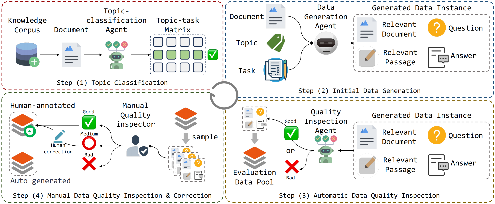

# <div align="center">OmniEval: Omnidirectional and Automatic RAG Evaluation Benchmark in Financial Domain <div>


<div align="center">
<a href="https://arxiv.org/pdf/2412.13018" target="_blank"></a>
<a href="https://huggingface.co/datasets/RUC-NLPIR/OmniEval-AutoGen-Dataset" target="_blank"></a>
<a href="https://huggingface.co/datasets/RUC-NLPIR/OmniEval-KnowledgeCorpus" target="_blank"></a>
<a href="https://huggingface.co/RUC-NLPIR/OmniEval-ModelEvaluator" target="_blank"></a>
<a href="https://huggingface.co/RUC-NLPIR/OmniEval-HallucinationEvaluator" target="_blank"></a>
<a href="https://huggingface.co/spaces/NLPIR-RAG/OmniEval" target="_blank"></a>
<a href="https://github.com/RUC-NLPIR/OmniEval/blob/main/LICENSE"></a>
<a></a>
</div>

<h4 align="center">

<p>
<a href="#wrench-installation">Installation</a> |
<!-- <a href="#sparkles-features">Features</a> | -->
<a href="#rocket-quick-start">Quick-Start</a> | 
<a href="#bookmark-license">License</a> | 
<a href="#star2-citation">Citation</a>

</p>

</h4>

<p align="center">

</p>
<!-- 
With FlashRAG and provided resources, you can effortlessly reproduce existing SOTA works in the RAG domain or implement your custom RAG processes and components. -->


## 🔧 Installation
```
conda env create -f environment.yml
conda activate finrag
```

<!-- ## :sparkles: Features
1. -->
## 🚀 Quick-Start
Notes:
1. The code run path is `OmniEval`
2. We provide the following datasets:
    1. Auto-generated evaluation dataset in <a href="https://huggingface.co/datasets/RUC-NLPIR/OmniEval-AutoGen-Dataset" target="_blank"></a>
    2. Constructed knowledge corpus in <a href="https://huggingface.co/datasets/RUC-NLPIR/OmniEval-KnowledgeCorpus" target="_blank"></a>
### 1. Build the Retrieval Corpus
1. If you use our provided knowledge corpus, do the following steps:
    1. download knowledge corpus from <a href="https://huggingface.co/datasets/RUC-NLPIR/FlashRAG_datasets/" target="_blank"></a>
    2. move "gen_datas_all-2048-256_nodes" and "gen_datas_all-2048-256_docs" into ./OpenFinBench/corpus/nodes_dir

2. If you need to build your self knowledge corpus, do the following steps:
    ```
    # cd OpenFinBench
    # set the following parameters inner the bash file `corpus_builder/build_corpus.sh`:
    # DATA_ROOT="corpus" # the root to save all retrieval data information
    # DATA_DIR="few_shot" # the dirname of the source documents. You should first put your documents in the $DATA_ROOT/$DATA_DIR.
    # SAVE_NAME="few_shot_test" #the dirname to save the built knowledge corpus. 
    # CHUNK_SIZE=2048
    # CHUNK_OVERLAP=256

    sh corpus_builder/build_corpus.sh
    ```
### 2. Generate Evaluation Data Samples
1. Generate evaluation instances
    ```
    # cd OpenFinBench
    # set the following parameters inner the bash file `data_generator/generate_data.sh`:
    # NODE_ROOT="corpus/nodes_dir" # the root to save the built knowledge corpus
    # SAVE_NAME="few_shot_test" # the save dir of your built document corpus, which is same as the above file.
    # CHUNK_SIZE=2048 # same with the above file. 
    # CHUNK_OVERLAP=256 # same with the above file.
    # NODE_NAME="${SAVE_NAME}-${CHUNK_SIZE}-${CHUNK_OVERLAP}" # the save name of your built knowledge corpus (same as the one in build_corpus.sh)
    # API_KEY="${your_own_api_key}" # your own api key
    # DATA_SUFFIX="test" # the indication of your current generation.

    sh data_generator/generate_data.sh
    ```
2. Filter (quality inspection) evaluation instances
    ```
    # cd OpenFinBench
    # set the following parameters inner the bash file `data_generator/generate_data_filter.sh`:
    # NODE_ROOT="corpus/nodes_dir" # the root to save the built knowledge corpus
    # SAVE_NAME="few_shot_test" 
    # CHUNK_SIZE=2048
    # CHUNK_OVERLAP=256
    # NODE_NAME="${SAVE_NAME}-${CHUNK_SIZE}-${CHUNK_OVERLAP}" # the save name of your built knowledge corpus (same as the one in build_corpus.sh)
    # API_KEY="" # your own api key
    # DATA_SUFFIX="test"
    # GEN_TYPE="filter" # when you need to do data quality inspection, set this parameter as "filter"

    sh data_generator/generate_data_filter.sh
    ```
    Note that after data quality inspection, there will be three more folders containing filtered or cleaned generated data, namely "gen_datas_${DATA_SUFFIX}_clean", "gen_datas\_${DATA_SUFFIX}\_filter", and "gen_datas\_${DATA_SUFFIX}\_final". Only the "gen_datas\_${DATA_SUFFIX}\_final" servers as the final generated evaluation data samples. The previous two are the intermediate productions. If your code is corrupted without finishing running, these two folders can also useful to avoid generating again. 
### 3. Inference Your Models
- Config api in `utils/api_config.py` if you need to use the api to do inference.
  ```python
  api_config = {
    "llama3-70b-instruct": "http://localhost:8080",
    "llama3-8b-instruct": "http://localhost:8080",
  }
  ```
```
# cd OpenFinBench
# set the following parameters inner the bash file `evaluator/inference/rag_inference.sh`:
# NODE_ROOT="corpus/nodes_dir" # the root to save the built knowledge corpus
# SAVE_NAME="few_shot_test" 
# CHUNK_SIZE=2048
# CHUNK_OVERLAP=256
# NODE_NAME="${SAVE_NAME}-${CHUNK_SIZE}-${CHUNK_OVERLAP}" # the save name of your built knowledge corpus (same as the one in build_corpus.sh)
# INDEX_ROOT="corpus/flash_rag_index" # the root to save the built index of the knowledge corpus
# PRED_RESULT_ROOT="evaluator/pred_results" # the root to save the inference results
# RAG_FRAMEWORK="vllm-openai" # the framework of your RAG model
# INFER_BATCH=4 # the batch size of your inference
# PER_GPU_EMBEDDER_BATCH_SIZE=32 # the batch size of your embedder

generators=("llama3-70b-instruct" "qwen2-72b" "yi15-34b" "deepseek-v2-chat") # set your target evaluation generation model names.
retrievers=("bge-m3" "bge-large-zh" "e5-mistral-7b" "gte-qwen2-1.5b" "jina-zh") # set your target evaluation retriever model names.

sh evaluator/inference/rag_inference.sh 
```
<!-- 
```
# cd OpenFinBench
sh evaluator/inference/rag_inference.sh 
``` -->
### 4. Evaluate Your Models
#### (a) Model-based Evalution
We propose five model-based metric: accuracy, completeness, utilization, numerical_accuracy, and hallucination. We have trained two models from Qwen2.5-7B by the lora strategy and human-annotation labels to implement model-based evaluation. 

Note that the evaluator of hallucination is different from other four. Their model checkpoint can be load from the following huggingface links:
1. The evaluator for hallucination metric: <a href="https://huggingface.co/RUC-NLPIR/OmniEval-HallucinationEvaluator" target="_blank"></a>
2. The evaluator for other metric: <a href="https://huggingface.co/RUC-NLPIR/OmniEval-ModelEvaluator" target="_blank"></a>


To implement model-based evaluation, you can first set up two vllm servers by the following codes:

```
BASE_MODEL_PATH=${your_local_root_of_Qwen2.5-7B-Instruct}
SERVER_NAME="Qwen2.5-7B-Instruct"
LOAR_NAME=Qwen2.5-7B-Evaluator # Qwen2.5-7B-Evaluator or Qwen2.5-7B-HalluEvaluator 
LORA_PATH=${your_local_root_of_OmniEval-ModelEvaluator} # or ${your_local_root_of_OmniEval-HallucinationEvaluator}

python3 -m vllm.entrypoints.openai.api_server \
    --model ${BASE_MODEL_PATH} \
    --served-model-name $SERVER_NAME \
    --max-model-len=32768 \
    --dtype=bfloat16 \
    --tensor-parallel-size=1 \
    --max-lora-rank 32 \
    --enable-lora \
    --lora-modules $LOAR_NAME=$LORA_PATH > vllm.server.log 2>&1 &
```

Then conduct the model-based evaluate using the following codes, (change the parameters inner the bash file).
```
# NODE_ROOT="corpus/nodes_dir" # the root to save the built knowledge corpus
# set the following parameters inner the bash file `evaluator/judgement/judger.sh`:

# SAVE_NAME="few_shot_test" 
# CHUNK_SIZE=2048
# CHUNK_OVERLAP=256
# NODE_NAME="${SAVE_NAME}-${CHUNK_SIZE}-${CHUNK_OVERLAP}" # the save name of your built knowledge corpus (same as the one in build_corpus.sh)
# EVAL_GENDATA_NAME="gen_datas_${your_suffix}" # folder name of generated evaluation dataset (that is same as the folder name of its inference results)

# retriever="bge-large-zh,gte-qwen2-1.5b" # set your target evaluation retriever model names, split by ','. The corresponding name2path map should be set in configs/model2path.json
# generator_model="deepseek-v2-chat,yi15-34b" # set your target evaluation generation model names, split by ','. The corresponding name2path map should be set in configs/model2path.json
# retrieval_topk=5
# judge_type="model" # model or rule
# hallu_eval=0 # hallucination evaluator is different to other evaluator. 1 = do hallucination evaluation, 0 = do other model-based metric evaluation. This parameter is only valid when judge_type="model"

# MODEL_EVAL_API=http://localhost:8000 # the access address of your vllm server of model-evaluator
# HALLU_EVAL_API=http://localhost:8000 # the access address of your vllm server of hallucination-evaluator

sh evaluator/judgement/judger.sh 
``` 
#### (b) Rule-based Evaluation
```
# cd OpenFinBench
# Just set the value of ${judge_type} to "rule"
# judge_type="model" # model or rule
sh evaluator/judgement/judger.sh
```
Note that when evaluating close-book LLMs, you should set "--close_book" in "evaluator/judgement/judger.sh".

3. Merge Evaluation results
After doing rule-based, model-based (hallucination and others) evaluation, there will be three files inner the save dir of each evaluated model (`evaluator/pred_results/gen_data_${your_suffix}/${retriever}_TOP${k}-${generator}`), i.e.:
    1. evaluation_result_rule.jsonl
    2. evaluation_result_model_qwen-eval-hallucination.jsonl
    3. evaluation_result_model_qwen-eval.jsonl
Merge the latter two to obtain the final results of model-based evaluation by the following commands:
    ```
    python evaluator/judgement/merge_pred_results.py # In the code, set root = "evaluator/pred_results/gen_datas_${your_suffix}"
    ```
    This command will generate the fourth evaluation file, named "evaluation_result_model_qwen-eval-merge.jsonl", which contains the final model-based evaluation result. 

## 🔖 License

OmniEval is licensed under the [<u>MIT License</u>](./LICENSE).

## 🌟 Citation
```bibtex
@misc{wang2024omnievalomnidirectionalautomaticrag,
      title={OmniEval: An Omnidirectional and Automatic RAG Evaluation Benchmark in Financial Domain}, 
      author={Shuting Wang and Jiejun Tan and Zhicheng Dou and Ji-Rong Wen},
      year={2024},
      eprint={2412.13018},
      archivePrefix={arXiv},
      primaryClass={cs.CL},
      url={https://arxiv.org/abs/2412.13018}, 
}
```
